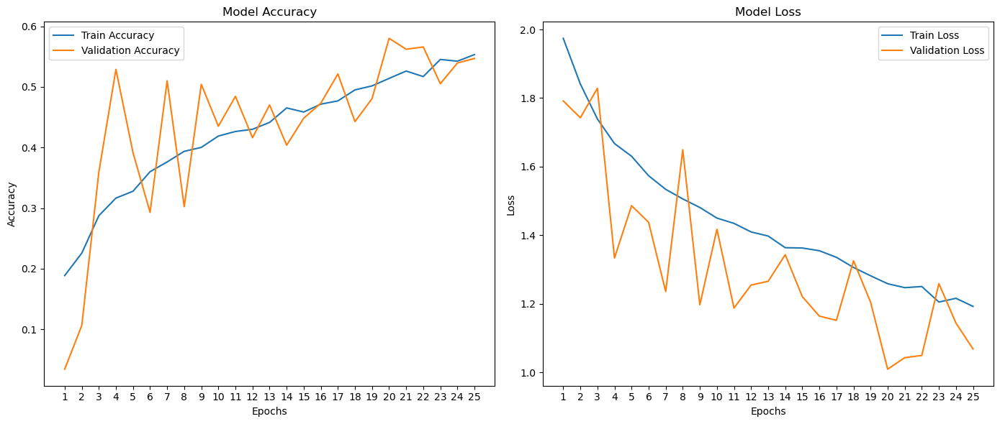
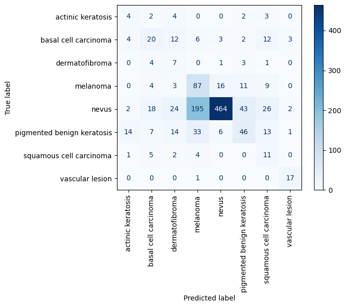
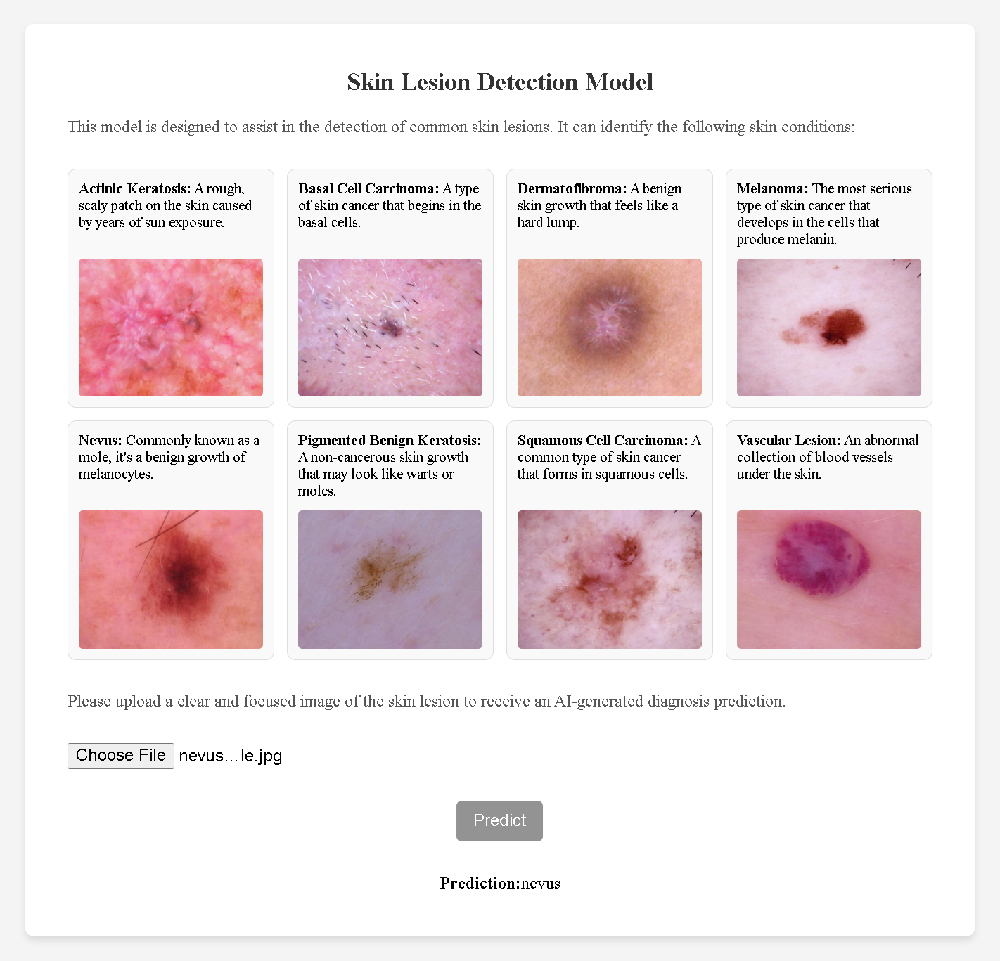

# Skin Lesion Detection Using Deep Learning

## 1. Introduction

This project focuses on developing a deep learning-based system to classify skin lesions using dermatoscopic images from the HAM10000 dataset. The model is designed to predict the type of skin lesion based on image input, offering a potential tool for assisting dermatologists in diagnosing skin conditions, including various types of skin cancer.

## 2. Dataset

The HAM10000 dataset, used for this project, contains dermatoscopic images from seven classes of skin lesions:

- Actinic Keratosis (AKIEC)
- Basal Cell Carcinoma (BCC)
- Dermatofibroma (DF)
- Melanoma (MEL)
- Nevus (NV)
- Pigmented Benign Keratosis (BKL)
- Squamous Cell Carcinoma (SCC)
- Vascular Lesion (VASC)

### Data Preprocessing

- **Image Resizing**: All images were resized to 128x128 pixels to ensure uniform input dimensions required by the CNN.
- **Normalization**: Pixel values were normalized to a range of 0-1, facilitating better convergence during model training.
- **Augmentation**: Data augmentation techniques such as rotation, flipping, and scaling were applied to increase the diversity of training data.
- **Class Balancing**: To handle class imbalance in the dataset, undersampling was applied to the majority class (Nevus), while oversampling was applied to the remaining classes to balance the dataset.

## 3. Model Development

The model employs a Convolutional Neural Network (CNN) architecture to classify the images into one of the lesion types. CNNs are effective at extracting spatial features from images, which are critical for differentiating between the lesion types.

### Model Architecture

- **Convolutional Layers**: These layers extract features from input images by applying filters that detect patterns such as edges, textures, and shapes.
- **Pooling Layers**: Pooling layers reduce the dimensionality of the data while retaining important features.
- **Fully Connected Layers**: These layers are responsible for the final classification, using the features extracted by the convolutional layers.
- **Output Layer**: The final output layer uses a softmax activation function, providing the probability distribution over the seven lesion classes.
- **Optimizer**: The model was trained using the Adam optimizer.
- **Loss Function**: Categorical cross-entropy was selected as the loss function, which is suitable for multiclass classification tasks.

## 4. Training and Evaluation

### Training Process

The model was trained on the HAM10000 dataset. During training, it learned to distinguish between the different skin lesion types based on their visual features. The model training was conducted over multiple epochs, with real-time adjustments to weights and biases to minimize the loss function.

### Training and Validation Accuracy & Loss Over Epochs

The plot shows that training accuracy steadily improved, while validation accuracy fluctuated but followed an upward trend. Both training loss and validation loss decreased over time, indicating effective convergence, although validation loss was more variable.

### Model Confusion Matrix

The confusion matrix provides a detailed look at the model’s performance across all classes, showing correct classifications as well as misclassifications. It helps identify which classes are predicted accurately and where the model struggles.

## 5. Model Deployment

The trained model was integrated into a web application using Flask to provide predictions based on user-uploaded images. This deployment demonstrates a practical use case for the model in a real-world setting.

### Web Application Features

- **Image Upload**: Users can upload a dermatoscopic image of a skin lesion via the web interface.
- **Prediction Output**: The model processes the uploaded image and returns the predicted class, displayed on the web page.

The web interface was built using HTML and CSS, providing a clean and intuitive layout for interaction. The Flask backend handles the communication between the model and the user interface, ensuring that predictions are made in real-time when a user uploads an image.

### Web Interface Layout

## 6. Challenges and Future Work

### Challenges

- **Class Imbalance**: The HAM10000 dataset contains a disproportionate number of samples for different lesion classes. For instance, classes like Melanoma (MEL) and Nevus (NV) are well-represented, while others like Vascular Lesion (VASC) have fewer samples.

### Future Work

- **Transfer Learning**: Using pre-trained models such as ResNet or EfficientNet could improve performance by leveraging learned feature representations from larger image datasets.
- **Mobile and Cloud Integration**: The model could be extended to mobile applications or cloud services, enabling wider access to the skin lesion prediction tool for clinicians and patients.

## 7. Conclusion

This project successfully developed and deployed a skin lesion classification model using deep learning. The model, trained on the HAM10000 dataset, shows promising results in predicting common skin lesions. However, improvements are needed, particularly in handling rare classes and generalizing to real-world clinical images. With further development and clinical testing, this model could become a valuable tool in dermatology.
